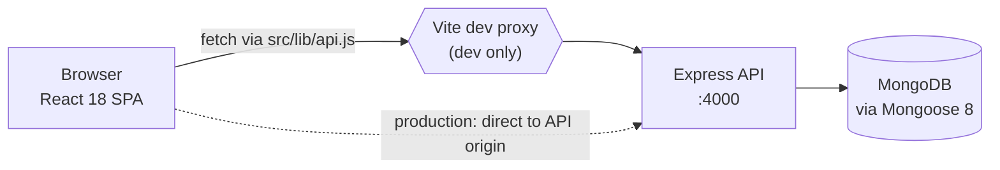
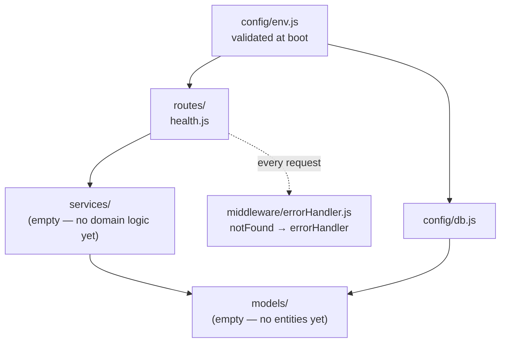

# Architecture

> Written from the repository as it stands on 2026-08-19, stage `scaffolded`.
> Sections marked **not yet built** describe a decision already recorded, not code you can read.
> Re-run `/write-docs` when that stops being true.

## Shape

One repository, two deployable units, one database.



In development the browser is same-origin: Vite proxies `/api` to `:4000`
(`client/vite.config.js:9`), so no CORS preflight happens on the common path. CORS is still
configured on the API (`server/src/app.js:10`) because production serves the two from different
origins unless a reverse proxy is put in front — **that choice is not yet made**, and it is the
single decision that most changes this diagram.

## Backend layering

The rule, enforced by review rather than by tooling:

```
routes/      HTTP only — parse, validate shape, call a service, return its result
  ↓
services/    all business logic and authorization; throws AppError, never touches res
  ↓
models/      Mongoose schemas; the only place a query is expressed
```



Why a route may not reach a model directly: authorization lives in the service layer, so a route
that queries a model itself is a route with no ownership check. That is the shape of most IDOR
findings, and keeping the layer boundary is what makes the check reviewable in one place.

`services/` and `models/` are currently empty. They are created by `/design-schema` and
`/build-module`, in that order, once the first epic is approved.

## Request lifecycle

1. `cors` — origin allow-list from `CORS_ORIGIN`.
2. `express.json({ limit: '1mb' })` — the body cap is deliberate; an unbounded parser is a
   denial-of-service surface.
3. Route match under `/api`.
4. **not yet built** — authentication, then authorization inside the service.
5. Handler → service → model.
6. No match falls to `notFound` (404); any throw falls to `errorHandler`.

Every response is JSON. Errors are always `{ error: { code, message } }`
(`server/src/middleware/errorHandler.js:26`), so the client's `ApiError`
(`client/src/lib/api.js:8`) has exactly one shape to parse.

A 500's message is replaced with `Internal server error` when `NODE_ENV=production`
(`errorHandler.js:21`) — internals do not reach a client — and the real error is logged server-side.

## Configuration and boot

`server/src/config/env.js` is the only file that reads `process.env`. It validates on import and
**throws before the server listens** if `MONGODB_URI` is absent. Verified 2026-08-19: starting with
an empty `MONGODB_URI` exits non-zero at boot with the missing-variable message.

This is deliberate. The alternative — defaulting a connection string — produces a process that
starts healthy and fails on the first real request, in production, at a time nobody is watching.

`server/src/index.js` connects to Mongo *before* creating the app, so a database that is unreachable
at startup is a failed start rather than a running server that 500s.

## Frontend structure

| Path | Holds |
| --- | --- |
| `src/lib/api.js` | the only place `fetch` is called; base URL, error shape, credentials |
| `src/pages/` | route-level components; a page owns its data fetching |
| `src/components/` | presentational, props-driven, no network calls |
| `src/App.jsx` | the router and layout chrome |

`HealthPage` shows the pattern the rest should follow: a three-state machine
(`loading` / `ready` / `error`), a cancellation flag so an unmounted component never sets state,
and `ApiError` distinguished from a transport failure (`client/src/pages/HealthPage.jsx:12`).

No state-management library and no UI system. Both are open decisions recorded in
`docs/delivery/PROFILE.md`; adding either quietly is a convention violation under `CLAUDE.md`.

## Data layer

MongoDB, accessed only through Mongoose. **There are no migrations** — the models *are* the schema.
The consequence is worth stating plainly because it shapes every schema story: a field rename or a
type change is a hand-written data script that someone must run against every environment, and
nothing in the repository will remind them. `/design-schema` is where that cost gets weighed, before
the model is written rather than after.

`strictQuery` is on (`server/src/config/db.js:5`), so an unrecognised field in a query is rejected
rather than silently ignored.

## Health and observability

`GET /api/health` returns 200 `{status:"ok", db:"connected", uptimeSeconds}` and **503 when Mongo is
disconnected** (`server/src/routes/health.js:11`). It reports the dependency rather than merely that
the process is alive, which is what makes it usable as a deploy gate.

Observability otherwise: `console.error` on unhandled 500s, and nothing else. There is no request
log, no correlation id, no audit trail. When the first write endpoint lands, an audit record is an
OWASP A09 requirement and must be in that epic's acceptance criteria — not a follow-up.

## Not yet built, and deliberately so

| Area | State | Arrives with |
| --- | --- | --- |
| Authentication | none | the baseline epic, before the first write route |
| Authorization / roles | none | same epic; dispatcher, technician and customer are implied by the domain but undecided |
| Domain models | none | `/design-schema` |
| Tests | no runner | `/write-tests`, standing the runner up first |
| CI | none | `/deploy` |
| Rate limiting | none | baseline epic — OWASP A04 |
| Audit logging | none | with the first write route — OWASP A09 |

None of these are defects at stage `scaffolded`. Each becomes one the moment a write endpoint exists
without it.
