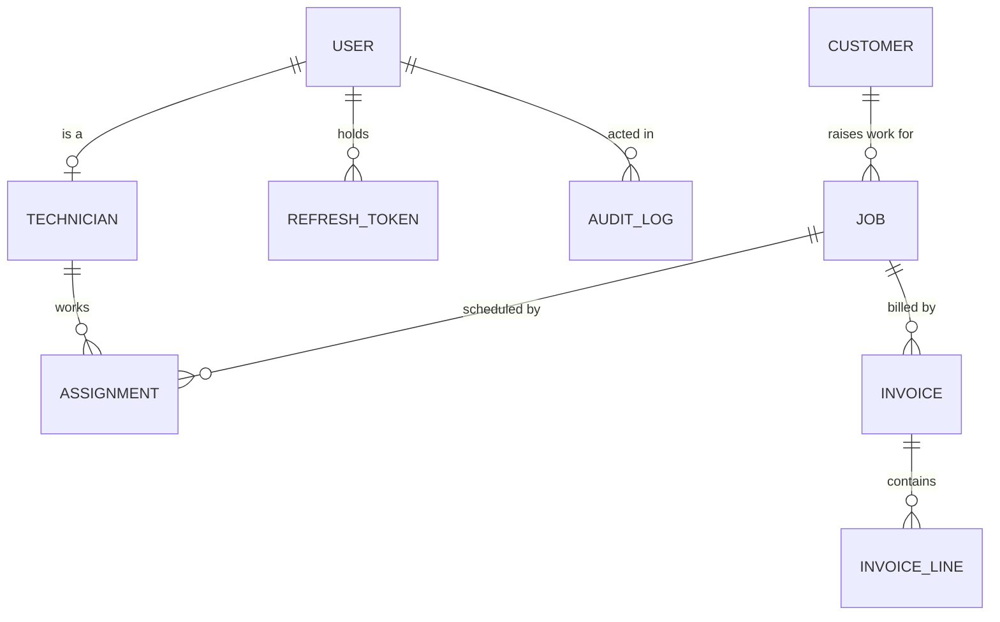

# Data model — FieldOps

Derived from `docs/knowledge/graph.json` and the 11 approved epics. Every field cites the source
that asked for it. **No model code is written until this document is `validated`.**

MongoDB 7 via Mongoose 8. `PROFILE.md` records **no migration tool — the models are the only
schema**, which makes every decision here more expensive to reverse than it would be elsewhere:
there is no `down` script, and nothing in the repository will remind anyone to backfill.

## Three entities the stories need that the graph does not contain

Stated plainly rather than slipped in. The graph describes the *business*; authentication is
machinery the business never mentioned, but `BE-01` cannot be built without it.

| Entity | Why it exists | Asked for by |
| --- | --- | --- |
| `User` | The graph has `act-dispatcher` and `act-technician` as **actors**, not as records. Something must hold an email, a password hash and a role. | BE-01-01 … BE-01-06 |
| `RefreshToken` | BE-01-03 AC-2 requires logout to invalidate a refresh token server-side. A stateless token cannot satisfy that criterion. | BE-01-03 |
| `AuditLog` | BE-01-08 requires an immutable record of sensitive actions. | BE-01-08 |

None is invented scope — each is traceable to an approved acceptance criterion. But none was
requested by the client either, and that distinction is recorded here deliberately.

## Entity relationship diagram



Read aloud in both directions at the gate:

- A customer raises many jobs; **a job belongs to exactly one customer.**
- A job has many assignments but **exactly one `active`** at a time; an assignment belongs to one job.
- A technician works many assignments; an assignment names exactly one technician.
- A job has many invoices **only because of void-and-reissue**; at most one is not `void`.
- A user is optionally one technician; a technician is exactly one user.

`JOB ||--o{ INVOICE` is the line most likely to be wrong. It is 1:N rather than 1:1 solely because
§8.3 allows reopening an invoiced job, which voids the invoice and (pending `q-reopen-reinvoice`)
produces a second one. If re-invoicing is not wanted, this becomes 1:1 and `BE-06-05` disappears.

---

## Entities

### User  *(proposed — not in the graph)*

| Field | Type | Required | Default | Unique | Indexed | Class | Retention | Source |
| --- | --- | --- | --- | --- | --- | --- | --- | --- |
| `_id` | ObjectId | yes | auto | yes | pk | internal | — | — |
| `email` | string(254), lowercased | yes | — | **yes** | unique | PII | see gate | BE-01-01 AC-2 |
| `passwordHash` | string | yes | — | no | no | **secret** | life of account | BE-01-01 AC-1 |
| `role` | enum `dispatcher\|technician` | yes | — | no | yes — role filters | internal | " | `dec-two-roles` §2.1 |
| `name` | string(120) | yes | — | no | no | PII | " | BE-01-01 AC-1 |
| `active` | boolean | yes | `true` | no | yes | internal | " | BE-01-02 AC-4 |
| `createdAt` / `updatedAt` | timestamp (UTC) | yes | auto | no | no | internal | " | — |

**Delete:** forbidden. Deactivation only (`con-soft-delete` §9.3).
**Never returned:** `passwordHash` is excluded from every projection by default, not filtered per
endpoint — a default-exclude is the only version of this that survives a new endpoint being added.

### Technician

Source: `ent-technician` · §2.1 — "Two roles log in: dispatcher and technician."

| Field | Type | Required | Default | Unique | Indexed | Class | Retention | Source |
| --- | --- | --- | --- | --- | --- | --- | --- | --- |
| `_id` | ObjectId | yes | auto | yes | pk | internal | — | — |
| `user` | ObjectId → User | yes | — | **yes** | unique | internal | life of account | proposed — see gate Q1 |
| `name` | string(120) | yes | — | no | yes — list sort | PII | see gate | `ent-technician` §2.1 |
| `email` | string(254) | yes | — | yes | unique | PII | see gate | `ent-technician` §2.1 |
| `active` | boolean | yes | `true` | no | yes — picker filter | internal | life of account | §9.3 |
| `deactivatedAt` | timestamp (UTC) | no | — | no | no | internal | " | §9.3 |

**Delete:** forbidden — deactivate (BE-03-05 AC-6).
**Open concern:** `name` and `email` are duplicated from `User`. That duplication is the reason
gate Q1 exists.

### Customer

Source: `ent-customer` · §1.1 — "Customers have jobs that need doing at their site"

| Field | Type | Required | Default | Unique | Indexed | Class | Retention | Source |
| --- | --- | --- | --- | --- | --- | --- | --- | --- |
| `_id` | ObjectId | yes | auto | yes | pk | internal | — | — |
| `name` | string(160) | yes | — | no | yes — list sort | PII | **blocked — `q-pii-retention`** | `ent-customer` §1.1 |
| `siteAddress` | string(500) | yes | — | no | no | **PII** | blocked | `ent-customer` §1.1 |
| `contactPhone` | string(40) | no | — | no | no | **PII** | blocked | `ent-customer` §1.1 |
| `contactEmail` | string(254) | no | — | no | no | **PII** | blocked | `ent-customer` §1.1 |
| `archived` | boolean | yes | `false` | no | yes — default filter | internal | life of account | §9.3 |
| `archivedAt` | timestamp (UTC) | no | — | no | no | internal | " | §9.3 |

**Delete:** forbidden — archive, blocked while open jobs exist (BE-02-05 AC-2, AC-5).
**Note:** `siteAddress` is free text. Nothing in the graph asks for structured address components or
geocoding, so none is proposed.

### Job

Source: `ent-job`, `proc-job-lifecycle` · §3.1

| Field | Type | Required | Default | Unique | Indexed | Class | Retention | Source |
| --- | --- | --- | --- | --- | --- | --- | --- | --- |
| `_id` | ObjectId | yes | auto | yes | pk | internal | — | — |
| `customer` | ObjectId → Customer | yes | — | no | yes — scoped lists | internal | life of account | `rel-customer-jobs` §1.1 |
| `description` | string(2000) | yes | — | no | no | internal | " | BE-04-01 AC-3 |
| `status` | enum `raised\|scheduled\|dispatched\|in_progress\|completed\|invoiced\|cancelled` | yes | `raised` | no | yes — every list filters it | internal | " | `ent-job` §3.1 |
| `assignedTechnician` | ObjectId → Technician | no | — | no | yes — technician scoping | internal | " | proposed — see gate Q2 |
| `startedAt` / `startedBy` | timestamp (UTC) / ObjectId → User | no | — | no | no | internal | " | BE-04-04 AC-1 |
| `completedAt` / `completedBy` | timestamp (UTC) / ObjectId → User | no | — | no | no | internal | " | BE-04-05 AC-1 |
| `completionNotes` | string(4000) | no | — | no | no | internal | " | §3.3 |
| `cancelledAt` / `cancelledBy` | timestamp (UTC) / ObjectId → User | no | — | no | no | internal | " | §9.2 |
| `cancelledReason` | string(1000) | no | — | no | no | internal | " | §9.2 — **required when `status = cancelled`** |
| `reopenedAt` / `reopenedBy` / `reopenedReason` | timestamp / ObjectId → User / string(1000) | no | — | no | no | internal | " | §8.3 |
| `createdAt` / `updatedAt` | timestamp (UTC) | yes | auto | no | yes — default sort | internal | " | — |

**Conditional requirement:** `cancelledReason` is optional at the schema level and **required by the
transition** (BE-04-06 AC-2). Mongoose expresses this with a conditional `required` function; the
alternative — enforcing it only in the service — means a direct database write can produce a
cancelled job with no reason.

**Blocked:** `q-completion-requirements` may add required fields here (photo, signature, parts, time
on site). Building `BE-04-05` before it is answered risks a second pass over this entity.

**Delete:** forbidden. `cancelled` is the terminal state for abandoned work.

### Assignment

Source: `ent-assignment` · §4.1–4.2, §8.1, §8.2. **The entity the core invariant lives on.**

| Field | Type | Required | Default | Unique | Indexed | Class | Retention | Source |
| --- | --- | --- | --- | --- | --- | --- | --- | --- |
| `_id` | ObjectId | yes | auto | yes | pk | internal | — | — |
| `job` | ObjectId → Job | yes | — | no | yes | internal | life of account | §4.1 |
| `technician` | ObjectId → Technician | yes | — | composite | yes | internal | " | §4.1 |
| `date` | date (business day, **operating timezone — see gate Q4**) | yes | — | composite | yes | internal | " | §8.1 |
| `slot` | enum `morning\|afternoon\|evening` | yes | — | composite | yes | internal | " | §8.1 |
| `status` | enum `active\|superseded` | yes | `active` | partial-unique | yes | internal | " | §8.2 |
| `supersededAt` | timestamp (UTC) | no | — | no | no | internal | " | §8.2 |
| `createdAt` / `createdBy` | timestamp / ObjectId → User | yes | auto | no | no | internal | " | — |

**The index that is the rule:**

```js
{ technician: 1, date: 1, slot: 1 }
  unique: true
  partialFilterExpression: { status: 'active' }
```

`partialFilterExpression` is not an optimisation — it is correctness. Without it, a superseded row
keeps its key and that technician's slot is unusable forever (BE-05-02 AC-3).

**Delete:** forbidden — supersede.

### Invoice · InvoiceLine  *(designed, epic NOT approved)*

`BE-06`/`FE-06` were held in draft at the story gate because `q-invoice-pricing`,
`q-void-invoice-rules` and `q-reopen-reinvoice` are open. These tables are the current best
proposal, recorded so the gate can see the whole model — **they must not be built.**

**Invoice**

| Field | Type | Required | Default | Class | Source |
| --- | --- | --- | --- | --- | --- |
| `job` | ObjectId → Job | yes | — | internal | §5.2 |
| `customer` | ObjectId → Customer | yes | — | internal | implied |
| `totalMinor` | **integer, minor units** | yes | — | internal | §5.2 |
| `currency` | string(3), ISO 4217 | yes | — | internal | **proposed — nobody stated a currency** |
| `status` | enum `unpaid\|paid\|void` | yes | `unpaid` | internal | §5.3, §8.3 |
| `issuedAt` | timestamp (UTC) | yes | — | internal | implied |
| `supersedes` | ObjectId → Invoice | no | — | internal | blocked — `q-reopen-reinvoice` |

**InvoiceLine**

| Field | Type | Required | Class | Source |
| --- | --- | --- | --- | --- |
| `invoice` | ObjectId → Invoice | yes | internal | §5.2 |
| `description` | string(500) | yes | internal | implied |
| `quantity` | decimal(10,2) | yes | internal | implied |
| `unitPriceMinor` | **integer, minor units** | yes | internal | implied |

**Money is a minor-unit integer, never a float.** `0.1 + 0.2 !== 0.3` in IEEE 754, and an invoice
total that is off by a cent is a defect nobody can explain and everyone notices.

### PasswordResetToken  *(added during BE-01, after validation)*

**This entity did not exist when this document was validated on 2026-08-19.** It was added while
building `BE-01-04`, which cannot be implemented without it. Recorded here rather than left only in
code, because a schema document that silently drifts from the models is worse than none.

`user` (→User, indexed), `tokenHash` (string, unique — the token itself is never stored),
`expiresAt` (timestamp, **TTL index**), `usedAt` (timestamp, nullable — enforces single use),
`createdAt`. Class: **secret**.

Needs sign-off at the next gate, alongside `BE-01-09`.

### RefreshToken · AuditLog  *(proposed)*

**RefreshToken** — `user` (→User, indexed), `tokenHash` (string, unique — the token itself is never
stored), `expiresAt` (timestamp, **TTL index**), `revokedAt` (timestamp, nullable), `createdAt`.
Class: **secret**.

**AuditLog** — `actor` (→User, indexed), `action` (enum: the list in BE-01-08 AC-1), `targetType` +
`targetId`, `outcome` (`success|denied`), `metadata` (object, **no PII, no tokens**), `createdAt`
(indexed descending). **Append-only:** no update or delete path exists at any layer (BE-01-08 AC-2).

---

## Relationships

| From | To | Cardinality | Owner of the reference | Required | On delete | Source |
| --- | --- | --- | --- | --- | --- | --- |
| User | Technician | 1:0..1 | Technician holds `user` | yes | forbidden — deactivate | proposed, gate Q1 |
| Customer | Job | 1:N | Job holds `customer` | yes | **restrict** — archive is blocked by open jobs | `rel-customer-jobs` |
| Job | Assignment | 1:N, exactly one `active` | Assignment holds `job` | yes | forbidden — supersede | `rel-job-assignment` §8.2 |
| Technician | Assignment | 1:N | Assignment holds `technician` | yes | forbidden — deactivate cascades to supersede | `rel-technician-assignments` §9.3 |
| Job | Invoice | 1:N, at most one non-`void` | Invoice holds `job` | yes | forbidden — void | `rel-job-invoice` |
| Invoice | InvoiceLine | 1:N | Line holds `invoice` | yes | cascade with the invoice | `rel-invoice-lines` |

`InvoiceLine` and `Assignment` are join-ish entities with their own attributes, so both are listed
as full entities rather than hidden inside a relationship row.

## Indexes

| Entity | Index | Serves | Story |
| --- | --- | --- | --- |
| Assignment | `{technician,date,slot}` unique, partial `status:'active'` | **the no-double-booking invariant** | BE-05-01 AC-2/AC-3 |
| Assignment | `{technician:1, date:1}` | availability grid in one query, not one per technician | BE-05-04 AC-3 |
| Assignment | `{job:1, status:1}` | find a job's active assignment | BE-05-02 AC-1 |
| Job | `{status:1, createdAt:-1, _id:-1}` | default board list, deterministic pagination | BE-04-03 AC-1/AC-4 |
| Job | `{assignedTechnician:1, status:1}` | technician queue scoping | BE-04-03 AC-2 |
| Job | `{customer:1, status:1}` | open-job check that blocks archiving | BE-02-05 AC-2 |
| Customer | `{archived:1, name:1}` | default list excluding archived, sorted | BE-02-03 AC-2/AC-3 |
| Technician | `{active:1, name:1}` | assignment picker | BE-05-01 AC-4 |
| User | `{email:1}` unique | login, duplicate rejection | BE-01-01 AC-2 |
| RefreshToken | `{tokenHash:1}` unique · `{expiresAt:1}` TTL | refresh, automatic expiry cleanup | BE-01-03 |
| AuditLog | `{createdAt:-1}` · `{actor:1, createdAt:-1}` | audit review | BE-01-08 |

Every index names the query that needs it. No index here is speculative.

## Transactional analysis

| Process | Writes that must succeed or fail together | Volume | Concurrency | Decision |
| --- | --- | --- | --- | --- |
| `proc-assign-technician` (BE-05-01) | Assignment insert **+** Job → `scheduled` | tens/day | two dispatchers, same slot | **the insert is protected by the unique index**; the Job update is the exposed half — see gate Q3 |
| Reassign (BE-05-02) | supersede old **+** insert new | low | rare | ordered supersede-then-insert leaves a window with no active assignment |
| Cancel (BE-04-06) | Job → `cancelled` **+** supersede assignment | low | single dispatcher | a failure here leaves the technician's slot blocked for work that will never happen |
| Deactivate technician (BE-03-05) | Technician → inactive **+** supersede N assignments **+** N jobs → `raised` | rare, fan-out | single dispatcher | unbounded write fan-out; partial failure leaves jobs half-unscheduled |
| Reopen invoiced job (BE-04-07) | void Invoice **then** Job → `in_progress` | rare | single dispatcher | **order is specified** by AC-2 and fails safe |
| Create technician (BE-03-01) | User insert **+** Technician insert | rare | — | partial failure leaves an account with no technician record |
| `proc-invoice-generation` (BE-06-01) | Invoice + lines + Job → `invoiced` | per completed job | billing run | **blocked** — epic not approved |

**Every row above needs the same decision, and it is an infrastructure decision, not a code one:**
MongoDB multi-document transactions require a **replica set**. A standalone `mongod` — which is what
a default local install and many single-VM deployments are — does not support them at all. Gate Q3.

## Data classification

| Class | Fields | Handling |
| --- | --- | --- |
| **secret** | `User.passwordHash`, `RefreshToken.tokenHash` | KDF/hash only; excluded from every projection **by default**; never logged, never returned |
| **PII** | `User.email`, `User.name`, `Technician.name`, `Technician.email`, `Customer.name`, `Customer.siteAddress`, `Customer.contactPhone`, `Customer.contactEmail` | never in logs (INF-00-06 AC-3), never in `AuditLog.metadata`; retention **blocked on `q-pii-retention`** |
| PHI | — | none; this is not a healthcare product |
| internal | everything else | — |

`PROFILE.md` marks GDPR as **likely but unconfirmed**. If it applies, export and deletion paths
become required and the "delete is forbidden everywhere" stance above needs a documented exception
for erasure requests. That is a real conflict, and it is not being resolved by assumption.

## Migration impact

The database is empty — no rows exist, so there is no backfill and nothing breaks.

That is true **once**. `PROFILE.md` records no migration tool, so the next change to any entity here
has no `down` path and no reminder. `INF-00-08` is the decision story for that, and it should be
settled before this schema is built, not after.

## Decisions taken at the validation gate

| Date | Question | Decision | Rationale | Decided by |
| --- | --- | --- | --- | --- |
| 2026-08-19 | Is a technician the same record as a user? | **Separate.** `Technician` holds a `user` reference. | A dispatcher never needs a Technician row, and an Assignment should reference a schedulable resource rather than a login. Accepts a two-collection create and duplicated name/email. | prity27 |
| 2026-08-19 | Keep `Job.assignedTechnician` denormalized? | **Yes.** | Technician job-list scoping (BE-04-03 AC-2) is the hottest query in the app; going through `Assignment` on every request costs a join on every page load. The drift risk is accepted and mitigated by the transaction decision below. | prity27 |
| 2026-08-19 | How is multi-document atomicity achieved? | **Single-node replica set**, so MongoDB transactions are available. | Seven processes need it. A standalone `mongod` cannot do transactions at all; `--replSet` with one node costs almost nothing operationally and removes an entire class of partial-write defect. | prity27 |
| 2026-08-19 | What timezone is `Assignment.date`? | **One operating timezone**, configured once. `date` stored as a plain `YYYY-MM-DD` string. | "Morning of the 20th" must mean one thing for the unique index to be meaningful. Nothing in the interview suggests multiple regions. | prity27 |

### What these decisions oblige

1. **`Job.assignedTechnician` must be written in the same transaction as every assignment change** —
   assign, reassign, unschedule, cancel, and the deactivation cascade. Outside a transaction it
   drifts, and a drifted value means a technician sees a job that is not theirs, which is the exact
   IDOR failure `BE-01-07` exists to prevent. This is now a review rule, not a hope.
2. **`Technician.name` / `.email` and `User.name` / `.email` are written together**, in one
   transaction, by `BE-03-01` and `BE-03-04`. `Technician` is the display source for scheduling
   views; `User` is the identity source for login.
3. **The replica set changes the local setup.** `mongod --replSet rs0` plus a one-time
   `rs.initiate()`. `INF-00-01` AC-1 fails until the README says so, and `PROFILE.md`'s database
   row must record it.
4. **`OPERATING_TIMEZONE` becomes a required environment variable**, validated at boot like
   `MONGODB_URI`. A date computed from the server's system clock is a bug waiting for the first
   deploy to a machine in another region.

### Still open against this schema

- **`q-pii-retention`** — every PII field's retention is unset. The model can be built; the
  retention policy is a separate, later change that does not alter field shapes.
- **`q-invoice-pricing`, `q-void-invoice-rules`, `q-reopen-reinvoice`** — `Invoice` and
  `InvoiceLine` are designed but their epic is not approved. **No model code is emitted for them.**
- **`q-completion-requirements`** — may add required fields to `Job`. `BE-04-05` stays blocked.
